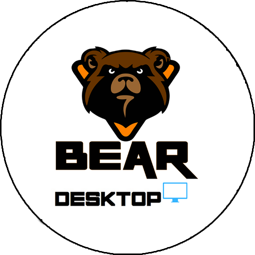

<h1 align="center"> J. Danilo Carmo </h1>

 
            
  
  
 Who am I? 

  
  📚 In constant learning
  
  🕵️‍♀️ Always building something

  🌱 Facinated to improve my skills

  😄 Likes to help others solve problems

  💬 Chat with me about: Instruments and philanthropy
  
  📫 Contact me:
  
  

    
    
  

- - - - -

**See some private repositories here:**

  
  
  
  
  

